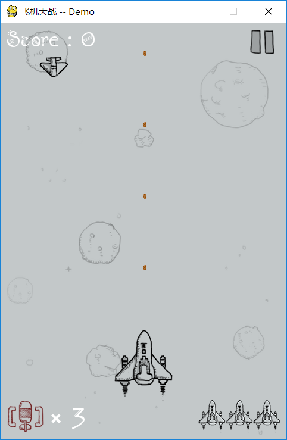

# 飞机大战 (微信版)
 
- 使用python的pygame模块制作
- 学习游戏中的碰撞检测, 音效等
- 体会面向对象编程的思想   

## 1. 游戏界面如图:
   

## 2. 游戏的基本设定

- 我方飞机有三次机会, 每次被敌方飞机撞毁时, 新诞生的飞机会有3秒的安全期(无敌状态)

- 每隔30秒会有一个随机的道具补给,分为两种道具, 全屏炸弹和双倍子弹

- 我方初始有3个全屏炸弹, 上限也为3个, 功能是炸毁屏幕中所有敌方飞机

- 双倍子弹, 功能是使我方飞机一次射出两颗子弹, 持续19秒

- 我方飞机子弹射程不是全屏, 大概是屏幕长度的80%

- 敌方飞机有大中小3种, 速度分别为高中低3种速度

- 消灭小飞机需要1发子弹, 中飞机需要8发子弹, 大飞机需要2发子弹

- 每消灭一架小飞机得1000分, 中飞机得6000分, 大飞机10000分

- 游戏根据分数来逐步提高难度, 难度提高表现为, 敌方飞机数量增加, 敌方飞机速度加快

- 游戏分为4个等级
    - 初始等级为1, 为 0分-50000分
    - 等级2为 50000分-300000分
    - 等级3为 300000分-600000分
    - 等级4为 600000分-1000000分

- 游戏为中型敌机和大型敌机增加了血槽显示, 可以直观知道敌机还有多少生命

- 游戏结束时显示历史最高分数 (存放在record.txt中)

## 3. 最初代码块(后续会改进代码的重用性等):

- 主程序               main.py

- 我方飞机类           myplane.py

- 敌方飞机类           enemy.py

- 子弹类               bullet.py

- 补给类               supply.py

- 历史最高分保存文档   record.txt
